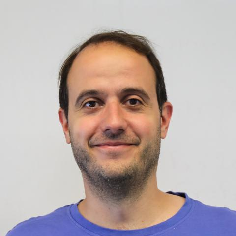
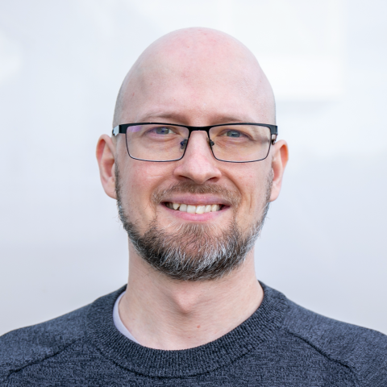
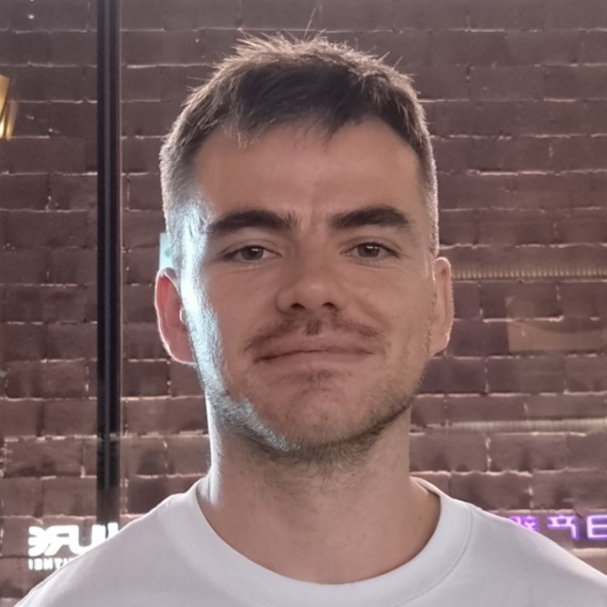
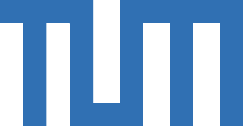
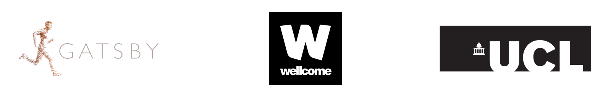
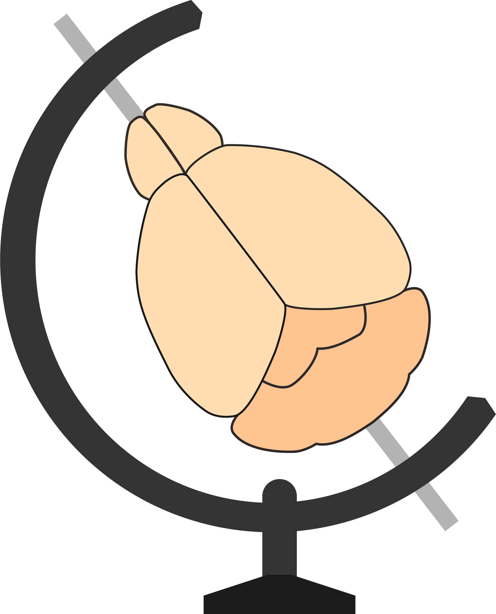

# Welcome

## Schedule Day 1 {.smaller}

::: {.incremental}
- Introductions (15 mins)
- Installing BrainGlobe and `napari` (15 mins)
- Introduction to Image analysis with `napari` (60 mins)
- Introduction to BrainGlobe (60 mins)
- **Lunch break (60 mins)**
- Symposium
:::

## Schedule Day 2 {.smaller}
::: {.incremental}
- Introduction to anatomical atlases and common coordinate spaces (60 mins)
- Introduction to image registration (60 mins)
- Introduction to template building (30 mins)
- **Lunch break (60 mins)**
- Registering whole brain microscopy images with `brainreg` (60 mins)
- Segmenting structures in whole brain microscopy images with brainglobe-segmentation (30 mins)
- Machine learning for image analysis (60 mins)
:::

## Schedule Day 3 {.smaller}
::: {.incremental}
- Introduction to cell detection in whole brain microscopy images with `cellfinder` (60 mins)
- Detecting cells in large 3D images with cellfinder (60 mins)
- Combining `brainreg` and `cellfinder` on the command line with `brainmapper` (30 mins)
- **Lunch break (60 mins)**
- Visualising data in atlas space with `brainrender` and `brainrender-napari` (45 mins)
- Scripting with `brainglobe-heatmap` and `brainrender` (30 mins)
- Contributing to BrainGlobe (30 mins)
- Hackathon preparation (45 mins)
:::

## Motivation
By the end of the course:

## Motivation {background-video="img/cellfinder_small.mp4" background-video-loop="true"}

# Introductions

## The instructor team {.smaller}

::: {style="display: grid; grid-template-columns: repeat(3, 1fr); gap: 1em; text-align: center;"}

::: {.fragment}
{width="60%"}\
Alessandro Felder
:::

::: {.fragment}
{width="60%"}\
Igor Tatarnikov
:::

::: {.fragment}
{width="60%"}\
Harry Carey
:::

:::

## [Mentimeter](https://www.menti.com/al8s7v312exn)

# Installation



# Image Analysis (with napari)
Adapted from [https://github.com/HealthBioscienceIDEAS/microscopy-novice/](https://github.com/HealthBioscienceIDEAS/microscopy-novice/) (under CC BY 4.0 license)







# BrainGlobe







# Image Registration



# Tutorials

## Tutorials {.smaller}

* Registering whole-brain microscopy to an atlas
* Segmenting probes and bulk fluorescence
* Cell detection in whole-brain microscopy
  * Retraining `cellfinder` to fine-tune cell detection
* Combining registration and cell detection
* Scripting with BrainGlobe

## Data {.smaller}

* Small sample data comes with `napari`
* Large sample data `brainglobe-course-data/MS_cx_left`
  * on HD: share if needed

::: aside
`MS_cx_left` data courtesy of 
Brown APY, Cossell L,Strom M, Tyson AL, Vélez-Fort M, Margrie TW. Analysis of segmentation ontology reveals the similarities and differences in connectivity onto L2/3 neurons in mouse V1. Scientific Reports. 2021; 11 (4983). <https://doi.org/10.1038/s41598-021-82353-7>
:::

## Quick excursion into BrainGlobe orientation {.smaller}

* three letters define position of pixel (0,0,0)
* e.g. `psl` - pixel (0,0,0) is Posterior, Superior, Left
* all BrainGlobe atlases are `asr`
* to verify: open data in napari and scroll through data
   * demo

## Registering whole brain microscopy images with brainreg

[Tutorial](https://brainglobe.info/tutorials/tutorial-whole-brain-registration.html)



## Segmenting structures in whole brain microscopy images with brainglobe-segmentation

[Tutorial (1D)](https://brainglobe.info/tutorials/segmenting-1d-tracks.html)

[Tutorial (2D/3D)](https://brainglobe.info/tutorials/segmenting-3d-structures.html)

# Machine learning for image analysis



# Cell detection with cellfinder

## Detecting cells in large 3D images with cellfinder

[Cell detection tutorial](https://brainglobe.info/tutorials/cellfinder-detection.html)

[Retraining tutorial](https://brainglobe.info/tutorials/cellfinder-retraining.html)

## Pulling things together: `brainmapper` CLI

:::: {.columns}
::: {.column}
* `brainmapper` is the name of [our command line tool](https://brainglobe.info/tutorials/brainmapper/index.html) to combine cell detection and atlas registration. 
:::
::: {.column}

:::
::::

## `brainmapper` CLI

* Required arguments
  * `-s` The primary signal channel
  * `-b` The secondary autofluorescence channel
  * `-o` The output directory 
  * `--orientation` e.g. `psl`
  * `-v` The voxel spacing (microns) in the same order as the data orientation (`psl`): 5 2 2.
  * `--atlas`

# Tour of other BrainGlobe tools

## Analysing cell positions in atlas space

[Tutorial](https://brainglobe.info/tutorials/transform-cells-atlas.html)

## Visualisation of data in atlas space with brainrender-napari

[Tutorial (brainrender-napari)](https://brainglobe.info/tutorials/visualise-atlas-napari.html)

## Making heatmaps with `brainglobe-heatmap` scripts

Task:

* Visualise the cell density/region of a coronal slice

[Example brainglobe-heatmap scripts](https://github.com/brainglobe/brainglobe-heatmap/tree/main/examples)

## Making renders with `brainrender` scripts

Tasks:

* Visualise a region in the atlas
* Visualise the cells from the large sample data
* (Bonus) Make an animation

[Example brainrender scripts](https://github.com/brainglobe/brainrender/tree/main/examples)

## Further user-facing tools

- [`brainglobe-registration`](https://github.com/brainglobe/brainglobe-registration)
- [`brainglobe-stitch`](https://github.com/brainglobe/brainglobe-stitch)
- [`brainglobe-template-builder`](https://github.com/brainglobe/brainglobe-template-builder)

## Underlying libraries
- [`brainglobe-atlasapi`](https://github.com/brainglobe/brainglobe-atlasapi)
- [`brainglobe-space`](https://github.com/brainglobe/brainglobe-space)
- [`brainglobe-utils`](https://github.com/brainglobe/brainglobe-utils)
- [`morphapi`](https://github.com/brainglobe/morphapi)

## How to get help
* [BrainGlobe website](https://brainglobe.info/){preview-link="true"}
* [Help forum](https://forum.image.sc/tag/brainglobe/){preview-link="true"}
* [Developer forum](https://brainglobe.zulipchat.com/){preview-link="true"}
* [GitHub](https://github.com/brainglobe/){preview-link="true"}

You are welcome to contribute to BrainGlobe - get in touch anytime and we will support you!

## Feedback

Please take 5 minutes to fill out [this feedback form](https://forms.gle/UZV2cregqCpuzbe3A)!

<!-- ## BrainGlobe Initiative {.smaller}

::: {.columns}
::: {.column width="55%"}
Since 2020:

:::{.incremental}
1. Developed general-purpose tools to help others build interoperable software for computational neuroanatomy.
2. Developed specialist software for specific analysis and visualisation needs.
3. Reduced barriers of entry, and facilitated the building of an ecosystem of computational neuroanatomy tools.
:::

:::
::: {.column width="45%"}

:::
::: -->

<!-- # Acknowledgements {visibility="hidden"}

## Acknowledgements
 

::: {.columns style="font-size: 0.75em; text-align: center;"}
:::: {.column width="33%"}
Federico Claudi Luigi Petrucco Adam Tyson Troy Margrie
::::
:::: {.column width="33%"}
Tiago Branco Ruben Portugues Charly Rousseau Christian Niedworok
::::
:::: {.column width="33%"}
Mateo Vélez-Fort Alessandro Felder Nikoloz Sirmpilatze Simon Weiler
::::
:::

::: {.fragment}
{.absolute height=120px top="52%" left="10%"}
{.absolute height=112px top="76%" right="0%"}
{.absolute height=100px top="52%" right="20%"} 
{.absolute width="78%" top=76% left="0%"}
:::

## {height=70px style="margin-bottom: 0px; margin-top: 0px;"} [Contributors](https://brainglobe.info/people.html)
::: {.columns .gray_link_div style="font-size: 0.4em;"}
:::: {.column width="20%"}
[Christian Niedworok](https://github.com/cniedwor)  
[Charly Rousseau](https://github.com/crousseau)  
[Horst Obenhaus](https://github.com/horsto)  
[Chryssanthi Tsitoura](https://github.com/chrytsi)  
[Sepiedeh Keshavarzi](https://github.com/Sepidak)  
[Mateo Vélez-Fort](https://github.com/velezmat)  
[Stephen Lenzi](https://github.com/stephenlenzi)  
[Rob Campbell](https://github.com/raacampbell)  
[Alessandro Felder](https://github.com/alessandrofelder)  
[Federico Claudi](https://github.com/FedeClaudi)  
[Luigi Petrucco](https://github.com/vigji)  
[Adam Tyson](https://github.com/adamltyson)  
[Troy Margrie](https://github.com/troymargrie)  
[Tiago Branco](https://github.com/ineuron)  
[Ruben Portugues](https://github.com/portugueslab)  
[Joe Ziminski](https://github.com/JoeZiminski)  
[Sofia Miñano](https://github.com/sfmig)  
[Niko Sirmpilatze](https://github.com/niksirbi)  
[Nicholas Del Grosso](https://github.com/nickdelgrosso)  
[Laura Porta](https://github.com/lauraporta)  
[Lee Cossell](https://github.com/lcossell)  
[Antonin Blot](https://github.com/ablot)  
[David Pérez-Suárez](https://github.com/dpshelio)  
[David Stansby](https://github.com/dstansby)  
[Will Graham](https://github.com/willGraham01)  
[Patrick Roddy](https://github.com/paddyroddy)
::::

:::: {.column width="20%"}
[Adrien Berchet](https://github.com/adrien-berchet)  
[Mathieu Bourdenx](https://github.com/MathieuBo)  
[bkntr](https://github.com/bkntr)  
[NovaFae](https://github.com/novafae)  
[David Young](https://github.com/yoda-vid)  
[Sam Clothier](https://github.com/samclothier)  
[Gubra-ApS](https://github.com/Gubra-ApS)  
[Kailyn Fields](https://github.com/kailynkfields)  
[ramroomh](https://github.com/ramroomh)  
[Samuel Diebolt](https://github.com/sdiebolt)  
[Chris Roat](https://github.com/chrisroat)  
[Oren Amsalem](https://github.com/orena1)  
[kclamar](https://github.com/kclamar)  
[Draga Doncila Pop](https://github.com/DragaDoncila)  
[juanma9613](https://github.com/juanma9613)  
[Jules Scholler](https://github.com/JulesScholler)  
[Iaroslavna Vasylieva](https://github.com/noisysky)  
[Nicolas Peschke](https://github.com/npeschke)  
[Justin Kiggins](https://github.com/neuromusic)  
[Peter Sobolewski](https://github.com/psobolewskiPhD)  
[Simão Bolota](https://github.com/SimaoBolota-MetaCell)  
[chili-chiu](https://github.com/chili-chiu)  
[jaimergp](https://github.com/jaimergp)  
[Sebastian Lammers](https://github.com/seblammers)  
[Matt Colligan](https://github.com/m-col)  
[Paul Brodersen](https://github.com/paulbrodersen)
::::

:::: {.column width="20%"}
[Carter Peene](https://github.com/rcpeene)  
[francesshei](https://github.com/francesshei)  
[Sean Martin](https://github.com/seankmartin)  
[Ben Dichter](https://github.com/bendichter)  
[4iar](https://github.com/4iar)  
[Marco Musy](https://github.com/marcomusy)  
[Anna Medyukhina](https://github.com/amedyukhina)  
[stegiopast](https://github.com/stegiopast)  
[EmanPaoli](https://github.com/EmanPaoli)  
[lidakanari](https://github.com/lidakanari)  
[Alexis Arnaudon](https://github.com/arnaudon)  
[Ziyang Liu](https://github.com/liu-ziyang)  
[Philip Shamash](https://github.com/philshams)  
[koushik-ms](https://github.com/koushik-ms)  
[Harald Reingruber](https://github.com/haraldreingruber)  
[Emily Jane Dennis](https://github.com/emilyjanedennis)  
[Peak](https://github.com/pattarika)  
[Maximilian Blacher](https://github.com/3ng7n33r)  
[Hernando Martinez Vergara](https://github.com/HernandoMV)  
[Estelle](https://github.com/enassar)  
[nicole-vissers](https://github.com/nicole-vissers)  
[GD](https://github.com/GDoumou)  
[Michael Kunst](https://github.com/mkunst23)  
[Estelle Nassar](https://github.com/estellenassar)  
[Sara Mederos](https://github.com/SaraMederos)  
[Igor Tatarnikov](https://github.com/IgorTatarnikov)
::::

:::: {.column width="20%"}
[Viktor Plattner](https://github.com/viktorpm)  
[Carlo Castoldi](https://github.com/carlocastoldi)  
[Jingjie Li](https://github.com/jingjie-li)  
[Guillaume Le Goc](https://github.com/GuillaumeLeGoc)  
[Harry Carey](https://github.com/PolarBean)  
[Matt Einhorn](https://github.com/matham)  
[Kimberly Meechan](https://github.com/K-Meech)  
[Robert Kozol](https://github.com/Robkozol)  
[Roberto](https://github.com/RobertoDF)  
[Axel Bisi](https://github.com/abisi)  
[Jung Woo Kim](https://github.com/kjungwoo5)  
[Saima Abdus](https://github.com/saimaabdus19)  
[Saarah Hussain](https://github.com/saarah815/)  
[Sacha Hadaway-Andreae](https://github.com/sacha091)  
[Presa](https://github.com/zenWai)  
[Henry Crosswell](https://github.com/HenryCrosswell)  
[Nischit Kumar](https://github.com/nischitkumar)  
[Kirato Yoshihara](https://github.com/kira1228)  
[Leonard Schwigon](https://orcid.org/0009-0004-1453-2638)  
[Dinora Abdulazhanova](https://uol.de/ibu/neurosensorik/team/dinora-abdulazhanova)  
[Katrin Haase](https://orcid.org/0000-0002-1365-2548)  
[Dominik Heyers](https://orcid.org/0000-0002-2831-6985)  
[Isabelle Museliak](https://orcid.org/0000-0001-7242-3123)  
[Henrik Mouritsen](https://orcid.org/0000-0001-7082-4839)  
[Simon Weiler](https://github.com/simonweiler)  
[Stella Prins](https://github.com/stellaprins)
::::

:::: {.column width="20%"}
[Richard Dushime](https://github.com/richarddushime)  
[Miguel Xochicale](https://github.com/mxochicale)  
[M S P](https://github.com/msp99000)  
[Abdul Samad](https://github.com/samadpls)  
[Prisha Sharma](https://github.com/parharti)  
[Farida Yusuf](https://github.com/frdysf)  
[Anshu Saini](https://github.com/0Anshu1)  
[Menna1812](https://github.com/Menna1812)  
[ayush2281](https://github.com/ayush2281)  
[BethCr](https://github.com/BethCr)  
[Swapnaneel Patra](https://github.com/thisisrick25)  
[Xiaoyu Deng](https://github.com/X-Deng)  
[DwarvesEatRocks](https://github.com/DwarvesEatRocks)  
[DPWebster](https://github.com/DPWebster)  
[Conrad](https://github.com/conradRz)  
[pranav33317](https://github.com/pranav33317)  
[Biswanath Saha](https://github.com/Elsword016)  
[Federico F.](https://github.com/Fede2717)  
[Tim Monko](https://github.com/TimMonko)  
[Kaixiang Shuai](https://github.com/Skxsmy)  
[Giulia Paci](https://github.com/giuliapaci)  
[Marco Dalla Vecchia](https://github.com/marcodallavecchia)  
[Pavel Vychyk](https://github.com/p-vychik)  
[Ishrat Zaman](https://github.com/ishratz25)  
[Asma Bashir](https://github.com/DrABashir)  
[Fatma S. Elsharkawy](https://github.com/FatmaElsharkawy)
::::
:::

::: {.footer}
[https://brainglobe.info/people.html](https://brainglobe.info/people.html)
:::
 -->
