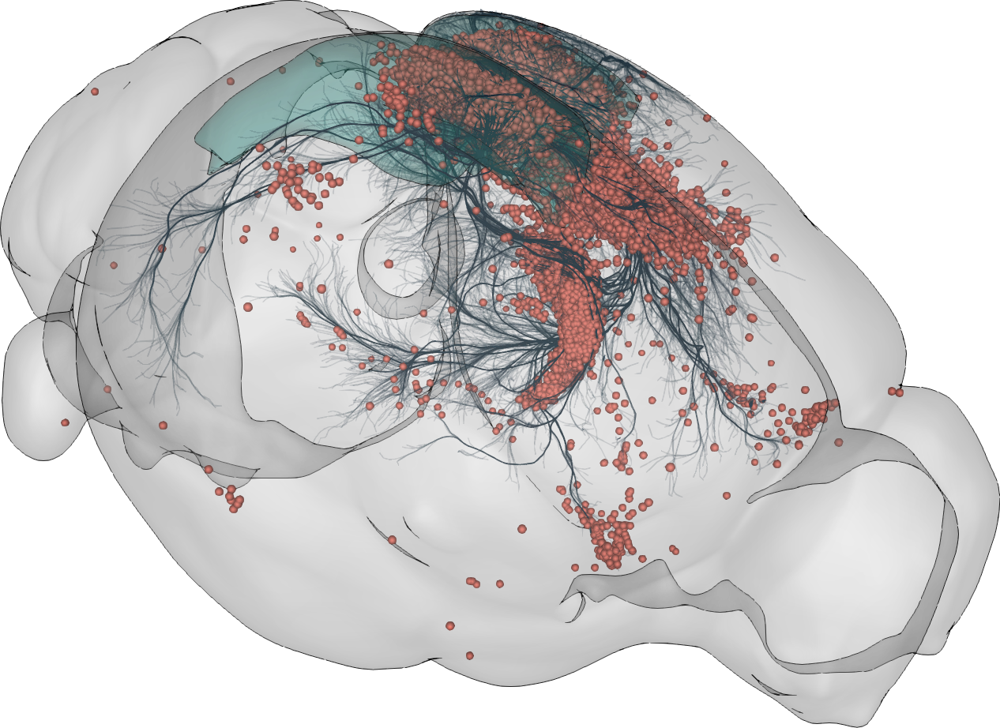
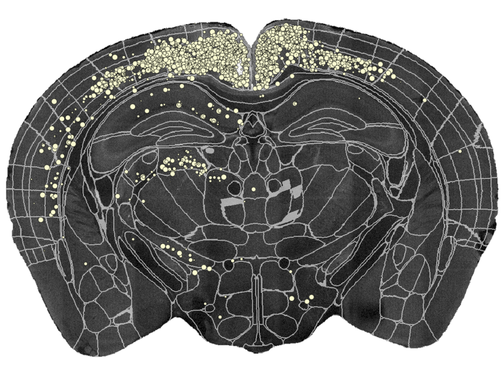

# Welcome

## Schedule (day 1) {.smaller}
::: {.incremental}
- Installing BrainGlobe and Napari (30 mins)
- Introduction to Image analysis with Napari (60 mins) 

- Introduction to BrainGlobe (30 mins)
- Registering whole brain microscopy images with brainreg (30 mins)
- Segmenting structures in whole brain microscopy images with brainglobe-segmentation (30 mins)

- Detecting cells in large 3D images with cellfinder (90 mins)

- Combining `brainreg` and `cellfinder` on the command line (`brainmapper`)(30 mins)
- Unstructured time (debugging problems, networking, discussions) (60 mins)
:::

## Schedule (day 2) {.smaller}
::: {.incremental}
- Analysing `brainmapper` outputs in napari (30 mins)
- Visualising atlases with `brainrender-napari` (30 mins) 
- Visualising cells in atlas space (30 mins)
 
- Visualising cell density with `brainglobe-heatmap` (30 mins)
- Scripting a visualisation with `brainrender` (30 mins)
- Tour of other BrainGlobe tools (30 mins)

- Where to get help (30 mins)
- Contributing to BrainGlobe and the Scientific Python ecosystem (30 mins)
- Contibuting an atlas to BrainGlobe (30 mins)

- Unstructured time (debugging problems, networking, discussions, scripting) (60 mins)
- Hackday ideas (30 mins)
:::

# Installation



# Image Analysis (with napari)
Adapted from [https://github.com/HealthBioscienceIDEAS/microscopy-novice/](https://github.com/HealthBioscienceIDEAS/microscopy-novice/) (under CC BY 4.0 license)





# BrainGlobe


  
# Tutorials

## Motivation
By the end of the course (maybe on your own data):

## Motivation {background-video="img/cellfinder_small.mp4" background-video-loop="true"}

## Tutorials (day 1) {.smaller}

* registering whole-brain microscopy to an atlas
* cell detection in whole-brain microscopy
  * retraining `cellfinder` to fine-tune cell detection
* combining registration and cell detection

## Data {.smaller}

* feel free to experiment with your own data
* small sample data comes with `napari`
* large sample data `MS_cx_left`
  * on HD: share

::: aside
`MS_cx_left` data courtesy of 
Brown APY, Cossell L,Strom M, Tyson AL, Vélez-Fort M, Margrie TW. Analysis of segmentationontology reveals the similarities and differences in connectivity onto L2/3 neurons in mouse V1. Scientific Reports. 2021; 11 (4983). <https://doi.org/10.1038/s41598-021-82353-7>
:::

## Quick excursion into BrainGlobe orientation {.smaller}

* three letters define position of pixel (0,0,0)
* e.g. `psl` - pixel (0,0,0) is Posterior, Superior, Left
* all BrainGlobe atlases are `asr`
* to verify: open data in napari and scroll through data
   * demo

## Registering whole brain microscopy images with brainreg

[Tutorial](https://brainglobe.info/tutorials/tutorial-whole-brain-registration.html)

## Segmenting structures in whole brain microscopy images with brainglobe-segmentation

[Tutorial (1D)](https://brainglobe.info/tutorials/segmenting-1d-tracks.html)

[Tutorial (2D/3D)](https://brainglobe.info/tutorials/segmenting-3d-structures.html)

## Detecting cells in large 3D images with cellfinder

[Cell detection tutorial](https://brainglobe.info/tutorials/cellfinder-detection.html)

[Retraining tutorial](https://brainglobe.info/tutorials/cellfinder-retraining.html)

## Pulling things together: `brainmapper` CLI

:::: {.columns}
::: {.column}
* `brainmapper` is the name of [our command line tool](https://brainglobe.info/tutorials/brainmapper/index.html) to combine cell detection and atlas registration. 
:::
::: {.column}

:::
::::

## `brainmapper` CLI

* Required arguments
  * `-s` The primary signal channel
  * `-b` The secondary autofluorescence channel
  * `-o` The output directory 
  * `--orientation` e.g. `psl 
  * `-v` The voxel spacing (microns) in the same order as the data orientation (`psl`): 5 2 2.
  * `--atlas`

## Quick reminder of BrainGlobe orientation {.smaller}

* three letters define position of pixel (0,0,0)
* e.g. `psl` - pixel (0,0,0) is Posterior, Superior, Left
* all BrainGlobe atlases are `asr`
* to verify: open data in napari and scroll through data

# Day 2

## Schedule (day 1) {.smaller}
::: {.incremental}
- Installing BrainGlobe and Napari (30 mins)
- Introduction to Image analysis with Napari (60 mins) 

- Introduction to BrainGlobe (30 mins)
- Registering whole brain microscopy images with brainreg (30 mins)
- Segmenting structures in whole brain microscopy images with brainglobe-segmentation (30 mins)

- Detecting cells in large 3D images with cellfinder (90 mins)

- Combining `brainreg` and `cellfinder` on the command line (`brainmapper`)(30 mins)
- Unstructured time (debugging problems, networking, discussions) (60 mins)
:::

## Schedule (day 2) {.smaller}
::: {.incremental}
- Analysing `brainmapper` outputs in napari (30 mins)
- Visualising atlases with `brainrender-napari` (30 mins) 
- Visualising cells in atlas space (30 mins)
 
- Visualising cell density with `brainglobe-heatmap` (30 mins)
- Scripting a visualisation with `brainrender` (30 mins)
- Tour of other BrainGlobe tools (30 mins)

- Where to get help (30 mins)
- Contributing to BrainGlobe and the Scientific Python ecosystem (30 mins)
- Contibuting an atlas to BrainGlobe (30 mins)

- Unstructured time (debugging problems, networking, discussions, scripting) (60 mins)
- Hackday ideas (30 mins)
:::

# Tutorials (day 2) 

## Analysing cell positions in atlas space

[Tutorial](https://brainglobe.info/tutorials/transform-cells-atlas.html)

## Visualisation of data in atlas space with brainrender and brainrender-napari

[Tutorial (brainrender-napari)](https://brainglobe.info/tutorials/visualise-atlas-napari.html)

[Example brainrender scripts](https://github.com/brainglobe/brainrender/tree/main/examples)

## Tour of other BrainGlobe tools and wrap-up {.smaller}
- [`brainglobe-atlasapi`](https://github.com/brainglobe/brainglobe-atlasapi)
- [`brainglobe-heatmap`](https://github.com/brainglobe/brainglobe-heatmap)
- [`brainglobe-registration`](https://github.com/brainglobe/brainglobe-registration)
- [`brainglobe-space`](https://github.com/brainglobe/brainglobe-space)
- [`brainglobe-stitch`](https://github.com/brainglobe/brainglobe-stitch)
- [`brainglobe-template-builder`](https://github.com/brainglobe/brainglobe-template-builder)
- [`brainglobe-utils`](https://github.com/brainglobe/brainglobe-utils)
- [`morphapi`](https://github.com/brainglobe/morphapi)

# BrainGlobe and the scientific Python ecosystem



# Wrap up

## Resources
* [BrainGlobe website](https://brainglobe.info/){preview-link="true"}
* [Help forum](https://forum.image.sc/tag/brainglobe/){preview-link="true"}
* [Developer forum](https://brainglobe.zulipchat.com/){preview-link="true"}
* [GitHub](https://github.com/brainglobe/){preview-link="true"}

You are welcome to contribute to BrainGlobe - get in touch anytime and we will support you!

## Thank you!

Please fill out [the feedback form](https://docs.google.com/forms/d/e/1FAIpQLSedaPDrcPC5Z6Rr_naeN63soEISjxWJAOAKfR59jBtLeH6PWg/viewform?usp=dialog).